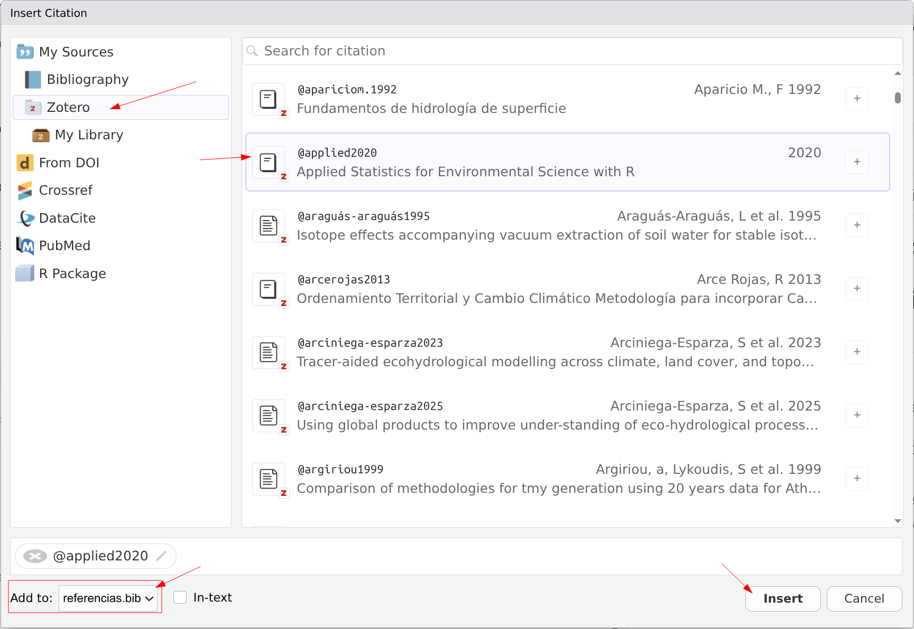

# Citas bibliográficas

## ¿Por qué automatizar las citas?

En un documento académico, las citas bibliográficas son esenciales pero también una fuente frecuente de errores:

- Citas en el texto que no aparecen en la lista de referencias (o viceversa).
- Formatos inconsistentes entre referencias.
- Renumeración manual cuando agregas o eliminas una fuente.

Quarto resuelve estos problemas: tú indicas *qué* citar y el sistema se encarga del *cómo*.

## El archivo `.bib`

Las referencias se almacenan en un archivo de texto con extensión `.bib` usando el formato **BibTeX**. Cada entrada tiene una estructura como esta:

``` bibtex
@article{chow1959,
  title   = {Open-Channel Hydraulics},
  author  = {Chow, Ven Te},
  year    = {1959},
  publisher = {McGraw-Hill}
}
```

Los elementos clave son:

- **Tipo de entrada**: `@article`, `@book`, `@inproceedings`, `@misc`, etc.
- **Clave de citación**: el identificador único (en este caso `chow1959`). Es lo que usarás en el texto para citar.
- **Campos**: `title`, `author`, `year`, `journal`, `doi`, etc.

### El archivo `referencias.bib` del curso

Este curso incluye un archivo `referencias.bib` con entradas de ejemplo. Puedes abrirlo para ver su contenido y agregar tus propias referencias.

## Cómo obtener entradas BibTeX

### Desde Google Scholar

1.  Busca el artículo en [Google Scholar](https://scholar.google.com).
2.  Haz clic en el ícono de comillas (`"`) debajo del resultado.
3.  Selecciona **BibTeX** en la ventana emergente.
4.  Copia el texto y pégalo en tu archivo `.bib`.

### Desde Zotero

Si usas [Zotero](https://www.zotero.org/) (un gestor de referencias gratuito):

1.  Selecciona las referencias que quieres exportar.
2.  Click derecho \> **Exportar elementos...**
3.  Elige formato **BibTeX**.
4.  Guarda como `referencias.bib` en la carpeta de tu proyecto.

### Desde el DOI

Muchas herramientas en línea generan BibTeX a partir del DOI del artículo. Por ejemplo: [doi2bib.org](https://www.doi2bib.org/).

## Gestor de referencias de RStudio.

RStudio puede ayudar a completar la información en el fichero bib a través del gestor de referencias integrado en el modo visual (@fig-citation) y las diferentes opciones (**Insert** \> **Citation** del documento en modo visual):

{#fig-citation}

## Conectar el archivo `.bib` al documento

En el encabezado YAML de tu documento, indica la ruta al archivo `.bib`:

``` yaml
---
title: "Mi informe"
author: "Tu nombre"
bibliography: referencias.bib                                       # <1>
format: html
---
```
1. Cuando solo aparece el nombre del fichero significa que el archivo `referencias.bib` se encuentra en el mismo directorio que documento qmd.

::: callout-note
En este curso, el archivo `referencias.bib` ya está configurado a nivel del libro en `_quarto.yml`, así que no se necesita agregarlo en cada documento individual.
:::

## Citar en el texto

Para insertar una cita, usa `@` seguido de la clave de citación:

| Sintaxis                    | Resultado                 |
|-----------------------------|---------------------------|
| `@chow1959`                 | @chow1959                 |
| `[@chow1959]`               | [@chow1959]               |
| `[@chow1959; @wickham2023]` | [@chow1959; @wickham2023] |
| `[-@chow1959]`              | [-@chow1959]              |

Ejemplos en contexto:

- Según @chow1959, el flujo en canales abiertos...
- El análisis de datos se realizó con R [@r_core2024] y el paquete tidyverse [@wickham2023].
- La metodología propuesta en [-@chow1959] ha sido ampliamente utilizada.

## Lista de referencias

Quarto genera automáticamente la lista de referencias al final del documento. Solo aparecen las fuentes que efectivamente citaste en el texto.

Si quieres que la sección tenga un título personalizado, agrega al final de tu documento:

``` markdown
## Referencias
```

Quarto insertará la lista de referencias en ese punto.

## Estilos de citación (CSL)

El formato de las citas (APA, IEEE, Vancouver, etc.) se controla con un archivo CSL (*Citation Style Language*). Puedes especificarlo en el YAML:

``` yaml
---
bibliography: referencias.bib
csl: apa.csl                     # <1>
---
```
1. Por defecto Quarto usa el estilo Chicago, formato Autor-fecha. en este caso el fichero `apa.cls` se encuentra también en el mismo directorio que el documento de quarto.

Puedes descargar estilos CSL desde el [repositorio de estilos de Zotero](https://www.zotero.org/styles). Algunos estilos comunes:

| Estilo    | Uso típico                    |
|-----------|-------------------------------|
| APA       | Ciencias sociales, psicología |
| IEEE      | Ingeniería, electrónica       |
| Vancouver | Ciencias de la salud          |
| Chicago   | Humanidades                   |

Si no especificas un CSL, Quarto usa el estilo Chicago Author-Date por defecto.

## Ejemplo completo

Supongamos que tienes este contenido en `referencias.bib`:

``` bibtex
@book{chow1959,
  title     = {Open-Channel Hydraulics},
  author    = {Chow, Ven Te},
  year      = {1959},
  publisher = {McGraw-Hill}
}

@article{wickham2023,
  title   = {Welcome to the Tidyverse},
  author  = {Wickham, Hadley and others},
  journal = {Journal of Open Source Software},
  year    = {2019},
  volume  = {4},
  number  = {43},
  pages   = {1686},
  doi     = {10.21105/joss.01686}
}
```

Y en tu documento:

``` markdown
El análisis hidrológico se basó en la teoría de flujo en canales abiertos
[@chow1959]. Los datos fueron procesados usando el ecosistema tidyverse
[@wickham2023] en el lenguaje R [@r_core2024].
```

Al renderizar, Quarto formatea las citas según el estilo elegido y genera la lista de referencias automáticamente.

## Actividad autónoma

1.  Ve a [Google Scholar](https://scholar.google.com) y busca **3 artículos o libros** relevantes para tu carrera.
2.  Exporta cada referencia en formato BibTeX.
3.  Crea un archivo `mis-referencias.bib` con las 3 entradas.
4.  Crea un documento Quarto que:
    - Tenga `bibliography: mis-referencias.bib` en el YAML.
    - Incluya al menos **3 citas** en el texto (una por cada fuente).
    - Use diferentes estilos de citación: `@clave`, `[@clave]` y `[@clave1; @clave2]`.
    - Termine con una sección `## Referencias`.
5.  Renderiza y verifica que la lista de referencias se genera correctamente.

## Ejemplo de lista de Referencias
